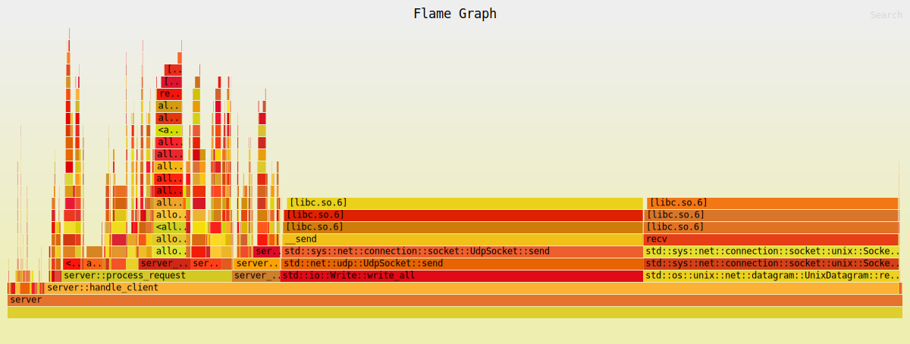

# Volatix




An In memory database :)

## Build the project

```bash
cargo build --release
```

## Start server

```bash
  cargo run --release --bin server [--threads<1..>]
```

## Start cli repl

```bash
  cargo run --release --bin cli
```

## Benchmarking

```bash
cargo run --release --bin volatix-bench \
[--duration<secs>] [--ratio<0..1>] [--threads<1..> [--compress]]
```
Defaults: 
- 30 secs duration
- 0.7 mixed-ratio
- 4 cpu threads
- Compression disabled

This project is licensed under the [MIT](LICENSE).

