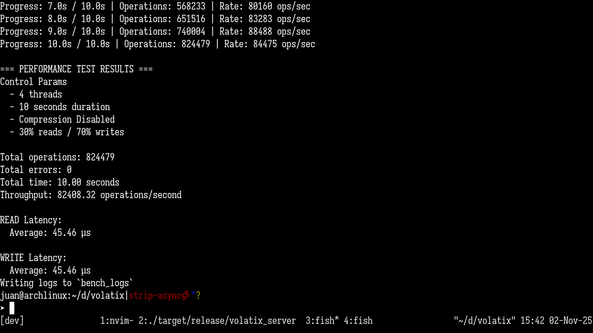

# Volatix

- 
- 

An In memory database :)

Documentation: 
- [Server](volatix-server/README.md) 
- [Cli](volatix-cli/README.md)

## Build the project

```bash
cargo build --release
```

## Start server

```bash
  ./target/release/volatix-server
  [--port<u16>] [--snapshots_interval<secs>]
```

## Start cli repl

```bash
  ./target/release/volatix-cli
```

## Benchmarking

```bash
  ./target/release/volatix-bench 
[--duration<secs>] [--ratio<0..1>] [--workers<1..>] [--compress] [--vsize<1..>]
```
Defaults: 
- 30 secs duration
- 0.7 mixed-ratio
- 4 cpu worker threads
- Compression disabled
- 2Kb sized mock value entries.

This project is licensed under the [MIT](LICENSE).

