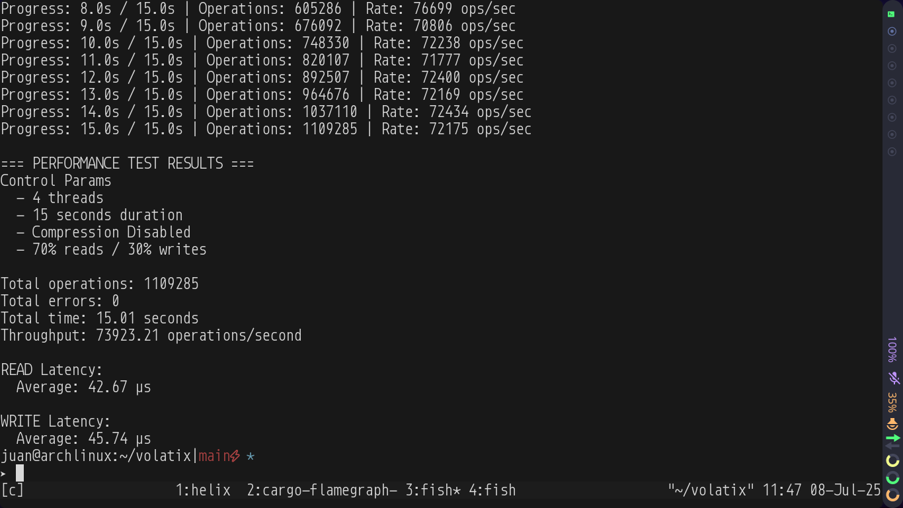

# Volatix



An In memory database. Still in development <skill issues :)>

## Build the project

```bash
cargo build --release
```

## Start server

```
  cargo run --release --bin server [--threads<1..>]
```

## Start cli repl

```
  cargo run --release --bin cli
```

Run some commands

```bash
HELP
SET key value
GET key
DELETE key

SETLIST [key, value, key, value, ..]
SETLIST {key, value, ..}

GETLIST {key, key, ..}
GETLIST [key, key, ..]

DELETELIST {key, key, ..}
DELETELIST [key, key, ..]
```

## Benchmarking

```bash
cargo run --release --bin volatix-bench \
[--duration<secs>] [--ratio<0..1>] [--threads<1..>]
```
Defaults: 
- 60 secs duration
- 0.7 mixed-ratio
- 4 threads

This project is licensed under the [MIT](LICENSE).
