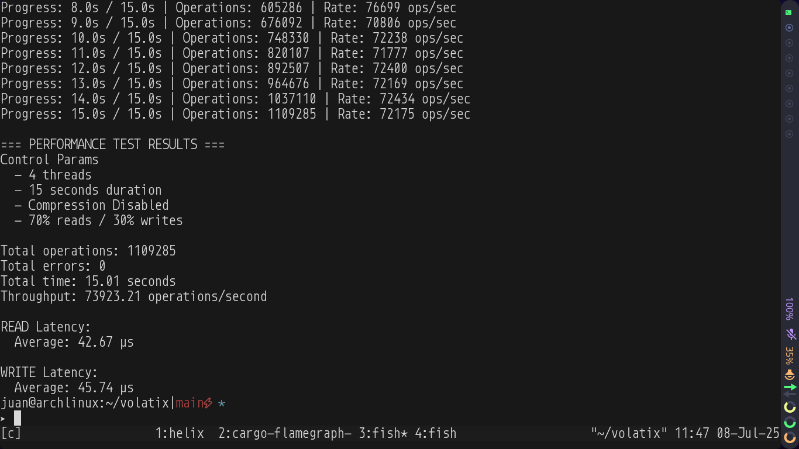
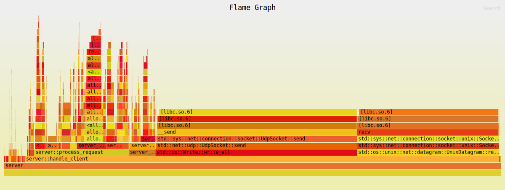

# Volatix




An In memory database :)

## Build the project

```bash
cargo build --release
```

## Start server

```bash
  cargo run --release --bin volatix-server [--threads<1..>]
```

## Start cli repl

```bash
  cargo run --release --bin volatix-cli
```

## Benchmarking

```console
cargo run --release --bin volatix-bench \
[--duration<secs>] [--ratio<0..1>] [--threads<1..> \
[--compress] [--capacity<u64>] [--expiration<secs>]
```
 Benchmarking Defaults: 
- 30 secs duration
- 0.7 ratio of reads to writes
- 4 cpu threads
 Storage Layer Defaults:
- Compression enabled
- 1_000_000 entries maximum capacity
- 6 hours Time to live (60 * 60 * 6) secs

This project is licensed under the [MIT](LICENSE).

